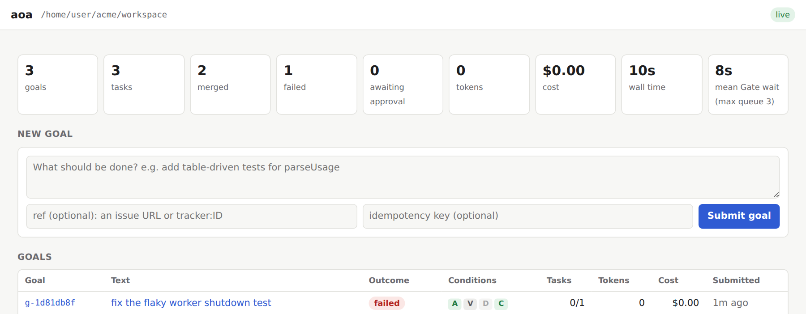
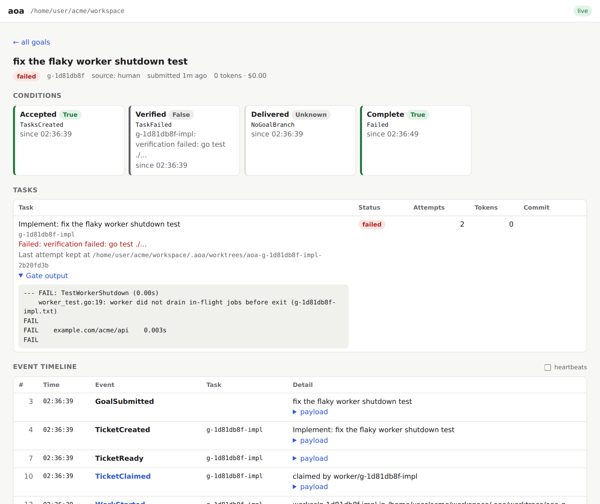

<p align="center">
  <picture>
    <source media="(prefers-color-scheme: dark)" srcset="docs/assets/readme/logo-dark.svg" />
    
  </picture>
</p>

<p align="center">
  <b>Run a fleet of coding agents against one repo, unattended, and come back to a <code>main</code> that still builds.</b>
</p>

<div align="center">

[](https://github.com/bharadwaj6/ageOfAgents/actions/workflows/ci.yml)
[](https://github.com/bharadwaj6/ageOfAgents/releases)
[](https://pkg.go.dev/github.com/bharadwaj6/ageOfAgents)
[](https://bharadwaj6.github.io/ageOfAgents/)
[](go.mod)
[](LICENSE)

**[Install](#install)** · **[Quickstart](#quickstart)** · **[How it works](#how-it-works)** ·
**[Backends](#bring-your-own-agent)** · **[Evidence](#evidence)** · **[Honest limits](#honest-limits)** ·
**[Docs](https://bharadwaj6.github.io/ageOfAgents/)**

</div>

Every agent gets a throwaway git worktree. Their output is serialised through a merge queue that runs
*your* build and tests on the **merged** result, and rolls back anything that breaks. The agent
proposes. It never decides.

```console
$ aoa goal "add rate limiting to the API"
$ aoa goal "migrate the auth tests to table-driven"
$ aoa goal "fix the flaky worker shutdown test"
$ aoa run

  [merged  ] g-638386cc-impl  (attempts=1 tokens=48,210)
  [merged  ] g-e9e3c987-impl  (attempts=2 tokens=131,884)
  [failed  ] g-4e7cf92f-impl  (attempts=2 tokens=96,004)

needs human — failed tickets:
  g-4e7cf92f-impl — gate failed: go test ./... (2 attempts)
      take over: cd ./workspace/.aoa/worktrees/aoa-g-4e7cf92f-impl-ea0391f7

total: tokens=276,098  wall=412.6s
merge queue: max-depth=3  wait-mean=0.2s  wait-max=1.4s
all work settled
```

Two landed, one didn't, and the one that didn't never touched `main`: its worktree is sitting there
for you. One static binary, one config file, git only. No database, no broker, no service to run.

<p align="center">
  <picture>
    <source media="(prefers-color-scheme: dark)" srcset="docs/assets/readme/ui-overview-dark.png" />
    
  </picture>
  <br />
  <sub><code>aoa ui</code> on those three goals, re-run offline with the <code>mock</code> backend against a small Go repo, hence 0 tokens and $0.00.</sub>
</p>

## Install

```bash
curl -fsSL https://raw.githubusercontent.com/bharadwaj6/ageOfAgents/main/scripts/install.sh | sh
```

macOS and Linux, amd64 and arm64. On Windows, or with Go 1.26.4+ already installed:

```bash
go install github.com/bharadwaj6/ageOfAgents/cmd/aoa@latest
```

Release binaries, from-source builds and shell completions:
[Install](https://bharadwaj6.github.io/ageOfAgents/install/). Features listed under
[on `main`](#whats-new) are not in a release yet; install them with `@main` instead of `@latest`.

## Quickstart

The whole loop, offline, in about ten seconds. No API key, no cost:

```bash
aoa quickstart --path ./workspace
```

That wraps four ordinary commands (`init` → `goal` → `run` → `status`) and prints each as it runs. The
default backend is `mock`, which is **a fixture, not a tiny model**. What you just exercised is the real
machinery: isolated worktree → your Gate → serialised merge → the Event Log, with nothing to pay for.
Pick a [real agent](#bring-your-own-agent) to get real code.

Then look at what happened:

```bash
aoa status --path ./workspace          # each goal's outcome
aoa events --path ./workspace tail     # the log all of that state was derived from
aoa ui --path ./workspace              # the same, live in a browser at http://127.0.0.1:7070 (on main)
```

> [!WARNING]
> **Before you swap `mock` for a real backend: `aoa` does not confine the agent.** It runs commands a
> model chose, as your user, with your files, your credentials and your network. The worktree is a
> working directory, not a boundary, and `sandbox = "docker"` containerises the **Gate**, not the agent.
> Run real backends where you would run untrusted code. `aoa doctor` says this out loud, and
> [`SECURITY.md`](SECURITY.md) and [ADR 018](https://bharadwaj6.github.io/ageOfAgents/design/adr/018-the-agent-is-not-confined/)
> explain what exists and why.

When something looks wrong, run `aoa doctor --path ./workspace` before you debug. It checks the things
that otherwise fail deep inside a run (a missing backend CLI, a Gate command not on `$PATH`, an Event
Log that won't replay) and prints the fix for each.

## What's new

**On `main`, not yet released:**

- **`aoa ui`: watch a goal execute in the browser, and act on it.** Every goal's outcome and conditions,
  each task's Gate output, and the event timeline, updated live. Submit, amend, cancel, approve and
  reject from the page. It ships inside the binary, listens on loopback only, and never runs the
  Scheduler. ([ADR 021](https://bharadwaj6.github.io/ageOfAgents/design/adr/021-a-local-web-view-is-the-cli-in-a-browser/))
- **`aoa wait` and goal conditions.** Every goal carries `Accepted`, `Verified`, `Delivered` and
  `Complete` conditions, replayed from the log, and `aoa wait <goal-id>` blocks until it is complete.
  ([ADR 020](https://bharadwaj6.github.io/ageOfAgents/design/adr/020-task-lifecycle-is-a-projection/))
- **`aoa diagnose` detects a flaky Gate**: content that drew both a pass and a failure.
- **Stopping `aoa run` stops its agents**, process group included.

**[v0.5.0](https://github.com/bharadwaj6/ageOfAgents/releases/tag/v0.5.0) (2026-09-20):** issues in,
reviewed pull requests out, on a budget.

- **`[delivery] mode = "pr"`**: one pull request per Goal, cut from a branch the Gate has passed, so a
  protected `main` is no obstacle.
- **Budgets that bound a run and a day**, enforced before spending, not after.
- **A reference GitHub Issues front door** in [`examples/github-issues`](examples/github-issues/README.md).
- **Parts of the release were built by `aoa` itself.** Three issues were labelled on the tracker, fixed by an
  agent in a throwaway worktree, gated by `make check`, then reviewed and merged by a human. The two
  metered ones cost $0.31 and $0.25.

Everything else is in the [changelog](CHANGELOG.md).

## Why it exists

**If you're supervising one agent on one change, you don't need this. Just tell it to run the tests.**
`aoa` is for the other case: several agents at once, or none of them watched. That case needs three
things a prompt can't give you.

| | The problem | What `aoa` does |
|---|---|---|
| 1 | **The agent grades its own homework.** "Only commit if the tests pass" is a *request*. The agent decides whether it ran them, which ones, and what passing meant. | Runs your Gate itself, in its own process, against the tree on disk. What the agent claims isn't an input to the decision. |
| 2 | **Two agents that each pass alone can still break together.** A is green, B is green, A+B is red. Neither could see the other. | Merges first, runs the Gate on the **merged** state, and reverts if it's red. This is why merge queues exist. |
| 3 | **Nobody is watching.** A context window survives no crash, no budget and no retry loop. | State is a replay of an append-only log, so a killed run resumes. It stops before a budget you set, and gives up on a task that fails the same way three times. |

The bet underneath: **verification, not intelligence, is the scaling constraint.** Better models
sharpen the worker; the control plane doesn't change.

## How it works


A Goal becomes a Task, dispatched to a Worker in its own worktree. The Worker emits a *candidate diff*.
The Merge Queue merges it, runs your Gate on the post-merge state, and keeps it only if the Gate passes.
Everything is an event and all state is a replay of the log, so crash recovery, audit trails and every
metric come for free.

Each guarantee has a mechanism behind it, and each is checked by the test suite:

| Guarantee | Mechanism | Checked by |
|---|---|---|
| **`main` is never red** | Serial merge queue; the Gate runs on the merged tree; roll back on failure | Invariant I1, TLA+ `MergeImpliesVerified` |
| **One writer, one merge per task** | Exactly one Scheduler per workspace and repository (lock; exit `75` otherwise) | Invariant I2, TLA+ `MergedAtMostOnce` |
| **A crash loses nothing** | All state is `state.Fold` over the Event Log; restart replays it | Invariant I3 + crash-recovery tests |
| **No step runs twice** | Idempotency keys on goals and tasks | Invariant I4, TLA+ `NoDuplicateMergedKey` |
| **The graph always settles** | Acyclic task graph, graph governor, per-task attempt limits | Invariants I5, I6 |
| **Spend is bounded before it happens** | Run and daily budgets checked at dispatch | Budget tests ([ADR 017](https://bharadwaj6.github.io/ageOfAgents/design/adr/017-spend-is-bounded-before-it-happens/)) |

Coordination is plain deterministic Go: no LLM in the control plane, no agents messaging each other,
no voting. Those are [deliberate refusals](#what-it-deliberately-does-not-do), each with a decision
record saying why.

<p align="center">
  <picture>
    <source media="(prefers-color-scheme: dark)" srcset="docs/assets/readme/ui-goal-dark.png" />
    
  </picture>
  <br />
  <sub>The goal that failed. The Gate's own <code>go test</code> output, the worktree kept for you to take over, and the events it was replayed from.</sub>
</p>

## Point it at your own repo

```bash
aoa init --path ./workspace --adopt /path/to/your/repo
```

This writes nothing into your tree and leaves it on its current branch. It sniffs a starting Gate from the
project (`go.mod` → `go build`/`go test`, `package.json` → `npm test`). It never provisions your test
environment: it runs the Gate you configure, on the machine you run it on. Edit `verify` in
`workspace/aoa.toml` if the guess is wrong.

<details>
<summary><b>A minimal <code>aoa.toml</code></b></summary>

```toml
repo        = "/path/to/your/repo"
backend     = "claudecode"          # or codex, grok, cursor, gemini, openai, anthropic, a custom cli
concurrency = 4                     # workers running at once
max_attempts = 2                    # retries per task, each against the Gate's last output
verify = [["go", "build", "./..."], ["go", "vet", "./..."], ["go", "test", "./..."]]

[delivery]
  mode   = "pr"                     # one pull request per Goal; the default "local" merges into the repo
  remote = "origin"
  base   = "main"

[budget]
  usd_per_day        = 20.0
  require_run_budget = true         # refuse `aoa run` without --max-usd or --max-tokens
```

Every field, with defaults: [Configuration](https://bharadwaj6.github.io/ageOfAgents/config-reference/).
</details>

## Bring your own agent

| `backend` | Needs | Reports cost? | Status |
|---|---|---|---|
| `mock` | nothing | n/a | offline fixture; every hermetic test runs on it |
| `claudecode` | the `claude` CLI | ✅ | verified |
| `codex` | the `codex` CLI | ✅ | **verified end to end** |
| `cursor` | the `cursor-agent` CLI | ❌ | flags verified; no live run |
| `grok` | the `grok` CLI (grok.com login, no API key) | ✅ | verified |
| `gemini` | the `gemini` CLI | ❌ | unverified |
| `openai` · `anthropic` | the matching API key | ✅ | native HTTP; not verified against the live API |
| **anything else** | your CLI | ❌ | `type = "cli"` in `aoa.toml`, no Go code |

*Verified* means a real Goal went through that backend to a merge. Where a harness reports no token
counts, `aoa` says so at startup rather than quietly showing you `$0`. Setup, flags and the reasoning
behind each: [Harnesses](https://bharadwaj6.github.io/ageOfAgents/harnesses/).

## Drive it from a board, a bot or an orchestrator

`aoa` is built to be the backend of something else: a tracker poller, a chat bot, an orchestrator such
as firstmate, or CI. The front door decides *what* gets worked on; `aoa` decides *whether it lands*.
Every verb speaks JSON:

```console
$ aoa goal --json --source linear --ref "$ISSUE_URL" --key linear:ENG-12 "fix the flaky shutdown test"
{"schema":1,"goal_id":"g-4504fef6","duplicate":false,"seq":1}
$ aoa run                                  # exits 75 if another run already holds the workspace
$ aoa wait g-4504fef6                      # block until complete; exits 0 landed / 1 failed or cancelled / 4 timed out
$ aoa status --json                        # each goal's outcome: queued, running, awaiting_approval, merged, delivered, failed or cancelled
$ aoa events --json --since 41 --follow    # the Event Log as a resumable stream
```

Resubmitting a key is a no-op, any number of processes can submit at once, and exactly one Scheduler
reconciles a workspace. The machine-readable contract is stable at `schema: 1`: within that version,
fields are only ever added. With `[delivery] mode = "pr"`, each goal comes back as a pull request.

The whole contract is in [Drive it from another system](https://bharadwaj6.github.io/ageOfAgents/backend/),
issues-to-PRs end to end is in [point it at your own repo](https://bharadwaj6.github.io/ageOfAgents/self-hosting/),
and the reasoning is in [ADR 015](https://bharadwaj6.github.io/ageOfAgents/design/adr/015-aoa-is-a-backend/).

## How it compares

`aoa` keeps the load-bearing primitives of agent orchestration (an event-sourced log, a serial merge
queue, isolation, idempotency) and deletes everything that puts an LLM in the coordination path.

| | **aoa** | Gastown | Spec Kit + plan mode | opencode ultraworker |
|---|---|---|---|---|
| LLM-free coordination | ✅ deterministic Scheduler | ❌ Mayor/Witness/Deacon are LLM agents | ✅ single agent | ~ policy varies |
| `main` never red | ✅ Gate on the merged tree | ~ Bors-style Refinery, but failing tests reported merged | ❌ no enforced gate | ~ depends on configured checks |
| Crash recovery by replay | ✅ | ~ ledger, but state also in tmux/process trees | ❌ | ❌ session-scoped |
| Idempotency keys | ✅ | ~ supervision, not keys | ❌ | ❌ |
| Parallel agents | ✅ worktrees + serial merge | ✅ | ❌ | ✅ its core feature |
| Footprint | one binary, JSONL, git | Dolt, tmux, OTel, sidecars | a workflow | part of the opencode app |

This is a **design-level** comparison from each system's documented architecture, not a live
head-to-head benchmark. Those systems change, and so may the cells. The long form, with the reasoning
per system: [Comparison](https://bharadwaj6.github.io/ageOfAgents/design/comparison/).

Two neighbours are **other layers**, not competitors. **Harnesses** such as OpenHands and SWE-agent arm one
agent run and sit *below* `aoa` as an `agent.Backend`. **Front doors** such as firstmate, OpenAI Symphony
and the Copilot coding agent pick the work and sit *above* it, driving the JSON contract.

## Evidence

Claims should come with their denominators. Here is what has been measured, and how large each sample is.

**Coordination correctness: proven hermetically, on every `make check`.** The invariants I1–I6
are asserted across **40 seeded fault-and-crash histories** (`internal/invariant`,
`internal/orchestrator/chaos_test.go`). The serial merge path is also
[model-checked in TLA+](https://bharadwaj6.github.io/ageOfAgents/design/formal/). The controlled
benchmark records **0 coordination LLM sessions** and **100% merge correctness** for every strategy.
The emergent strategy unlocks parallelism that the single-agent and plan-first baselines can't:

| task | strategy | merged | max parallel workers | critical path | coordination LLM calls | merge-correct |
|---|---|---:|---:|---:|---:|---:|
| chat-app | single | 1 | 1 | 1 | 0 | 100% |
| chat-app | planfirst | 2 | 1 | 2 | 0 | 100% |
| chat-app | emergent | 4 | 2 | 3 | 0 | 100% |

**The loop closes on real repositories, with real backends, on real money.**

| Run | Backend | Gate | Result | Attempts | Tokens |
|---|---|---|---|---:|---:|
| Seeded failing test (`scripts/live_smoke.sh`) | `claudecode` | `go build` + `go test` | merged, correct | 1 | — |
| Missing unit test, existing Go repo | `grok` | build + vet + **full suite** | merged, correct | 2 | 606,669 |
| A change to an existing repo, 2026-08-24 | `codex` | the repo's Gate | merged, correct | 2 | 590,623 |
| SWE-bench `astropy-14365`, Gate on | `grok` | the repo's own tests | Gate rejected a regression; retry resolved | 2 | — |

**Whether the Gate changes outcomes at scale is not established.** In the pre-registered
[#103 pilot](https://bharadwaj6.github.io/ageOfAgents/design/live_eval/#gate-precision) (10 SWE-bench
instances × 2 backends), the `repo` Gate **rejected 0 of 20 proposals**. That makes Gate precision
unmeasurable on this sample, and it is published as a null result. The next pre-registered question asks
what the Gate *lets through*. Every older SWE-bench number was produced with the Gate *disabled*, so those
runs measure the backend, not `aoa`. All of it, caveats included, is in
[live evaluation](https://bharadwaj6.github.io/ageOfAgents/design/live_eval/).

<details>
<summary><b>Reproduce it</b></summary>

```bash
make check            # build + vet + the hermetic suite, invariants included; no API keys
make chaos COUNT=20   # a longer fault-injection soak
make bench            # the coordination benchmark above
make formal           # TLA+ model check (needs java + TLA2TOOLS)
make smoke            # one live run through a real agent (needs an authenticated `claude` CLI)
```

The SWE-bench and Gate-precision harnesses are in [`scripts/`](scripts/README.md).
</details>

## Honest limits

- **The agent is not confined.** It runs as you, with your files, credentials and network. See the
  warning above and [`SECURITY.md`](SECURITY.md).
- **The Gate is only as good as your tests.** A weak suite lets a bad change merge green. `aoa` makes
  your checks non-negotiable; it can't make them sufficient. A nondeterministic Gate can pass a patch it
  rejected before. `aoa diagnose` flags that, but only after the fact.
- **The Gate's value at scale is unproven**, as described under [Evidence](#evidence). Treat it as a
  correctness floor, not a quality multiplier.
- **The harness sets the level, not `aoa`.** On the same five SWE-bench instances, ungated, `grok`
  resolved 4 and `claudecode` 3. `aoa` doesn't make a model smarter.
- **Budgets can overshoot by one attempt per worker.** Attempts already running finish. Give the harness
  its own per-attempt cap and keep `concurrency` small when that matters.
- **`aoa` doesn't provision your test environment.** It runs the Gate you configure, where you run it.
- **Several backends are unverified end to end**: `cursor`, `gemini`, and native `openai`/`anthropic`.
- **Disjoint-file merge batching isn't in the TLA+ model.** Only the serial merge path is model-checked.
- **One Scheduler per workspace and repository.** A second `aoa run` exits `75` instead of racing the first.

## What it deliberately does not do

| Refused | Why | Decision |
|---|---|---|
| An LLM coordinator or role hierarchy | Coordination is where multi-agent systems fail; keep it deterministic | [ADR 003](https://bharadwaj6.github.io/ageOfAgents/design/adr/003-flat-orchestrator-worker/) |
| Voting, debate, consensus, markets | Correctness comes from the build and tests, not agent opinion | [ADR 005](https://bharadwaj6.github.io/ageOfAgents/design/adr/005-no-markets-no-consensus/) |
| Agent-to-agent messaging | Agents coordinate through the shared log by emitting new tasks | [ADR 006](https://bharadwaj6.github.io/ageOfAgents/design/adr/006-emergent-task-graph-blackboard/) |
| State outside the Event Log | A side table is a second truth that can disagree with the first | [ADR 001](https://bharadwaj6.github.io/ageOfAgents/design/adr/001-event-sourced-truth/) |
| Triage, discovery and LLM intake | Deciding *what* to work on belongs to the front door | [ADR 015](https://bharadwaj6.github.io/ageOfAgents/design/adr/015-aoa-is-a-backend/) |

All 21 decisions: [decision records](https://bharadwaj6.github.io/ageOfAgents/design/adr/).

## Docs

**[bharadwaj6.github.io/ageOfAgents](https://bharadwaj6.github.io/ageOfAgents/)**

| | |
|---|---|
| First run, explained step by step | [Get started](https://bharadwaj6.github.io/ageOfAgents/getting-started/) |
| Every command, flag and `aoa.toml` field | [CLI](https://bharadwaj6.github.io/ageOfAgents/cli/) · [Configuration](https://bharadwaj6.github.io/ageOfAgents/config-reference/) |
| Running it on a schedule (cron, launchd, Actions) | [Scheduling](https://bharadwaj6.github.io/ageOfAgents/scheduling/) |
| Driving it from a task board, bot or orchestrator | [Backend contract](https://bharadwaj6.github.io/ageOfAgents/backend/) |
| Why it's built this way | [Architecture](https://bharadwaj6.github.io/ageOfAgents/design/architecture/) + [decision records](https://bharadwaj6.github.io/ageOfAgents/design/adr/) |
| What the agent can reach on your machine | [Security](https://bharadwaj6.github.io/ageOfAgents/security/) · [`SECURITY.md`](SECURITY.md) |

## Contributing

Read [`CONTRIBUTING.md`](CONTRIBUTING.md), and [`AGENTS.md`](AGENTS.md) for the golden rules the design
won't bend on. Run `make check` before every commit; the suite is hermetic and needs no API keys.
Step-by-step recipes for common changes (a new backend, a new event, a structural change) live in
[`.claude/skills/`](.claude/skills/), written for AI agents and humans alike.

## Prior art

The rule isn't new. Graydon Hoare called it the
[not-rocket-science rule](https://graydon2.dreamwidth.org/1597.html), *automatically maintain a
repository of code that always passes all the tests*, and wrote `bors` to enforce it for Rust. `aoa`
applies it to a fleet of authors that are faster, cheaper, more numerous, and considerably more
confident than they have earned.

MIT licensed.
