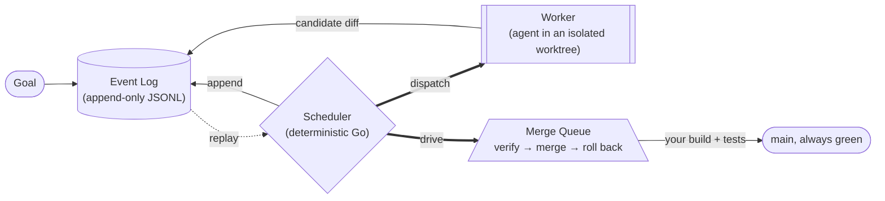

# Age of Agents

[](https://github.com/bharadwaj6/ageOfAgents/actions/workflows/ci.yml)
[](LICENSE)
[](go.mod)

**Point an AI coding agent at your repo and it might write something broken. `aoa` runs the agent in a
throwaway git worktree, runs *your* build and tests on the result, and merges it only if they pass.**

It is a merge queue whose author happens to be a language model — Bors for AI agents. One static binary,
one config file, git only: no database, no broker, no service to run.

```
$ aoa goal "add table-driven tests for parseUsage"
$ aoa run

  [merged  ] g-45973ca0-impl  (attempts=2 tokens=606,669)
  total: tokens=606,669  wall=343.7s
  all work settled
```

That run is real: the agent's first attempt failed, the retry passed the full test suite, and `main` was
green afterwards. See [the receipts](#why-this-is-different--the-receipts).

---

## Quick Start

**Prerequisites:** Go **1.26.4+** (see [`go.mod`](go.mod)) and `git`. Nothing else — the default backend
runs offline with no API key.

```bash
go install github.com/bharadwaj6/ageOfAgents/cmd/aoa@latest
```

Or grab a binary from [Releases](https://github.com/bharadwaj6/ageOfAgents/releases), or build from
source:

```bash
git clone https://github.com/bharadwaj6/ageOfAgents.git && cd ageOfAgents
make install          # puts `aoa` in $GOBIN (or $GOPATH/bin)
```

Now run the whole loop offline, in about ten seconds:

```bash
aoa init --path ./workspace --repo ./demo     # scaffolds a demo git repo + aoa.toml
aoa goal --path ./workspace "add a greeting function"
aoa run  --path ./workspace
```

```
goal g-acedd614: add a greeting function
  graph g-acedd614: tickets=1 depth=0 fan-out=0

  [merged  ] g-acedd614-impl  (attempts=1 tokens=0)

total: tokens=0  wall=0.9s
all work settled
```

Then look at what happened:

```bash
aoa status --path ./workspace                 # goals, tasks, tokens, cost, "needs human" handoffs
aoa events --path ./workspace tail --count 10 # the Event Log every bit of that state came from
```

**What the demo actually proved.** The default `backend = "mock"` is a *fixture, not a tiny model*: it
writes one placeholder file named after the Task. So the demo ends with a `g-….txt` committed to `main` —
that is the point. It exercises the real machinery (isolated worktree → your Gate → serialized merge → the
Event Log) end to end with no network and no cost. Swap in a real backend below to get real code.

### Use it on your own repo

```bash
aoa init --path ./workspace --adopt /path/to/your/repo   # stays on its current branch; Gate auto-detected
```

`aoa` never provisions your test environment — it runs the Gate you configure, on the machine you run it
on. Edit `verify` in `workspace/aoa.toml` if the auto-detected one is wrong.

### Pick a backend

Set `backend` in `aoa.toml`:

| `backend` | Needs | Notes |
|---|---|---|
| `mock` | nothing | the offline fixture; every hermetic test runs on it |
| `grok` | the `grok` CLI on `$PATH` (local grok.com login, **no API key**) | **used to verify the loop end to end**; reports true tokens and cost |
| `claudecode` | the `claude` CLI on `$PATH`, authenticated | real CLI harness; reports true tokens and cost |
| `openai` | `OPENAI_API_KEY` | native HTTP, no CLI. **Not verified against the live API** |
| `anthropic` | `ANTHROPIC_API_KEY` | native HTTP, no CLI. **Not verified against the live API** |

A missing CLI is caught at startup, not after your retry budget is spent.

> **Security:** an agent backend runs commands the model chooses, on your machine, with your permissions.
> `sandbox = "docker"` isolates the **Gate**, not the agent. Read [`SECURITY.md`](SECURITY.md) before
> pointing a real backend at anything you care about.

## How it works



A Goal becomes a Task, dispatched to a Worker in its own git worktree. The Worker emits a *candidate diff*;
the Merge Queue merges it, runs your Gate against the **post-merge** state, and keeps it only if the Gate
passes — otherwise `main` is reset. Everything is an event; all state is a replay of the log, so crash
recovery, audit and every metric come for free.

There is no planner: a Goal becomes exactly **one** Task. The graph grows only when a Worker decides its
own Task is too large and emits subtasks ([ADR 007](docs/design/adr/007-emergent-decomposition-and-graph-governor.md)) —
deliberately, because a deterministic control plane has no business guessing at decomposition.

## Where to go next

| If you want to… | Read |
|---|---|
| a step-by-step tutorial | [`docs/getting-started.md`](docs/getting-started.md) |
| every `aoa.toml` field, with defaults | [`docs/config-reference.md`](docs/config-reference.md) |
| a worked config for a real repo | [`examples/`](examples/) |
| run it on a schedule (cron, systemd, Actions) | [`docs/scheduling.md`](docs/scheduling.md) |
| contribute a change | [`CONTRIBUTING.md`](CONTRIBUTING.md) + [`CODE_OF_CONDUCT.md`](CODE_OF_CONDUCT.md) |
| see what changed between releases | [`CHANGELOG.md`](CHANGELOG.md) |
| know what it does to your machine | [`SECURITY.md`](SECURITY.md) |
| understand the design | [`docs/design/architecture.md`](docs/design/architecture.md) + the [ADRs](docs/design/adr/) |

---

## Configuration (`aoa.toml`)

```toml
repo                = "./demo"          # git repository for agents to work on
backend             = "mock"            # "mock" (offline) | "openai" | "anthropic" | "claudecode" | "grok"
concurrency         = 4                 # max Workers running at once
max_attempts        = 2                 # retries before a Task fails
best_of_n           = 1                 # concurrent attempts per Task; the Gate picks the winner
conventions_file    = "CONVENTIONS.md"  # coding rules injected into every agent prompt
require_approval     = false            # if true, park each verified proposal for `aoa approve`
max_tokens_per_goal = 0                 # spend governor: per-goal token ceiling (0 = unlimited)
max_usd_per_goal    = 0                 # spend governor: per-goal $ ceiling (needs [pricing])
retry_backoff       = "0s"              # wait before re-dispatching a failed Task (grows per attempt)
crash_loop_threshold = 3                # give up after N identical failures, even under max_attempts
stall_timeout       = "2m"              # no-progress timeout before a Worker is restarted
agent_timeout       = "30m"             # hard ceiling on one agent attempt (bounds runtime, not silence)
poll_interval       = "100ms"           # pause between passes while workers are busy (ADR 013)
max_passes          = 1000              # hard cap on reconcile passes in one run
max_graph_depth     = 5                 # graph governor: emergent decomposition depth
max_tickets_per_goal = 64               # graph governor: total Tasks one Goal may spawn
max_fan_out         = 8                 # graph governor: children per decomposition
sandbox             = ""                # "" (host) | "docker" — how the Gate's commands are isolated
sandbox_image       = ""                # image for sandbox="docker" (default golang:1.26; set for non-Go gates)
verify = [                              # the Gate — nothing merges unless this passes
  ["go", "build", "./..."],
  ["go", "test", "./..."],
]
regression_verify = []                  # optional broader set; measures the regression-escape rate
                                        # (never blocks a merge — see docs/design/metrics.md)

[pricing]                               # optional: $ per *million* tokens, by model — powers cost columns
# claudecode = 15.0
```

Every field, with defaults and when to set it, is in the [configuration reference](docs/config-reference.md);
a worked config and copy-paste runbook are in [`examples/`](examples/).

## Commands

| Command | What it does |
|---------|--------------|
| `aoa init [--repo \| --adopt PATH] [--force]` | Scaffold a demo, or adopt your own repo (Gate auto-detected); `--force` overwrites an existing `aoa.toml` |
| `aoa goal "…"` | Submit a Goal |
| `aoa run [--once\|--interval D] [--otel\|--otel-live]` | Run the Scheduler (reconciles to settled, then exits `0`; `--once` for a single pass, `--interval` to keep going on a cadence). Safe to re-run any time — see [scheduling](docs/scheduling.md) |
| `aoa status [--watch]` | Goals, Task states, per-ticket tokens, run cost, and a "needs human" handoff for failures |
| `aoa amend <goal> "…"` | Append steering guidance to a Goal mid-run (future dispatches pick it up; ADR — `GoalAmended`) |
| `aoa approve \| reject <ticket>` | Decide a proposal parked by the approval gate (ADR 008) |
| `aoa events tail [--count N] \| replay` (`aoa feed` = deprecated alias) | Inspect the Event Log |
| `aoa diagnose [--json]` | MAST-style failure-mode histogram for a run |
| `aoa eval --tasks T [--price-file F] [--max-cost $] [--otel]` | Run end-to-end eval tasks; per-task success, tokens, `$` (with a cost ceiling), MAST |
| `aoa bench [--json]` | The hermetic coordination benchmark |
| `aoa serve [--port N] [--secret S]` | GitHub webhook server: an `@aoa <goal>` issue comment queues a Goal. See [scheduling](docs/scheduling.md) |
| `aoa otel export` · `aoa run --otel[-live]` | Replay the Event Log to OTLP traces + metrics — post-hoc, or `--otel-live` to stream live (any OpenTelemetry backend) |
| `aoa version` | Print the build version, commit and date |

Every subcommand takes `--path DIR` (default `.`) and `--help`. Flags come **before** positional text:
`aoa goal --path ./ws "do the thing"`, not the other way round.

## Why this is different — the receipts

This isn't a gentler org chart (no Mayor/Witness/Deacon, no role hierarchy, no agents chatting). It's the
boring distributed-systems core, with proofs attached:

- **The Event Log is the single source of truth** — an append-only JSONL ledger; all state is derived by
  replay, so crash recovery, audit, and every metric come for free (ADR 001).
- **A verifier-gated, serializing merge queue** keeps `main` linearizable and always green: merge → run
  the Gate on the *post-merge* state → keep it only if it passes, else roll back (ADR 002).
- **One deterministic Scheduler**, not eleven — no LLM in the control plane; coordination is plain Go via
  the shared log (ADR 003).
- **Proven, not asserted:** a hermetic Jepsen-style invariant harness with seeded fault injection, plus a
  TLA+ model of the merge/approval invariants. The whole test suite is offline (the `mock` Backend never
  touches the network).
- **Honest about its own ceiling:** because the system is only as good as its Gate, it *measures* the
  blind spot — a [regression-escape rate](docs/design/metrics.md) (merges the Gate accepted but a broader
  shadow test set would reject) and a per-run **MAST** failure-mode histogram (`aoa diagnose`).
- **Cost-aware and bounded:** token/`$` accounting per ticket and per goal, a per-goal **spend governor**
  (circuit breaker), and retry **backoff + crash-loop** detection so a runaway loop can't burn your budget.
- **OpenTelemetry-native, vendor-agnostic:** every run replays into OTLP **traces** (goal → ticket →
  attempt spans) and **metrics** — point it at Honeycomb, Grafana Tempo, Datadog, or any OTLP backend via
  the standard env vars (`aoa run --otel`). Off by default; observability is just another replay
  projection of the log, not hot-path instrumentation (ADR 012). See [`docs/integrations/`](docs/integrations/README.md).
- **Adoptable and recoverable:** point it at your own repo on any branch (`aoa init --adopt`); on a
  terminal failure it preserves the agent's worktree and hands it back to you (`aoa status`).
- **It does the job on a real repository.** Two runs on 2026-08-23, `grok` backend, each asked for a
  specific missing unit test on a real Go repo:

  | Gate | Result | Attempts | Wall | Tokens |
  |---|---|---|---|---|
  | `go build` + one package's tests | merged, correct | 1 | 105s | — *(usage was still unreported)* |
  | `go build` + `go vet` + **the full suite** | merged, correct | **2** | 344s | 606,669 |

  The second is the interesting one. Its first attempt burned 316k tokens and was **abandoned before it
  ever produced a proposal** — the Gate never saw it — and the retry then passed the full suite and
  merged, leaving `main` green. So the retry path works; what that run also showed is that an abandoned
  attempt is expensive and, until this was fixed, recorded no reason anywhere. Re-running either settled
  workspace does no work and exits `0`.

  Two tasks are not a solve-rate. They are the claim that the loop closes end to end — which is the claim
  this README makes, and no more than that.

> **SWE-bench Lite:** no headline solve-rate, and the reason is worth stating. Every run recorded in
> `logs/run_evaluation/` (best: 10/11 with `grok`) was produced with **aoa's Gate disabled** — the eval
> script passed `--inference-mode`, so every proposal merged unconditionally. Those numbers were scored
> honestly by the official Docker harness, but they measure the backend agent, not the verifier-gated
> merge queue this project is about.
>
> The first Gate-on vs Gate-off comparison ran on 2026-08-23 (see
> [`docs/design/live_eval.md`](docs/design/live_eval.md)): on 2 instances, both configurations resolved
> both, and the Gate rejected 1 of 2 proposals on `astropy-14365` — catching a patch that broke the
> repo's existing tests and recovering on retry. That is the mechanism working, at a cost of one extra
> attempt. It is not yet evidence that the Gate changes outcomes; two instances support no rate.

## Core Concepts

| Concept | What it is |
|---|---|
| **Goal** | What you want done, in plain English |
| **Task** | A single piece of work derived from a Goal |
| **Worker** | An AI agent working on one Task in an isolated git worktree |
| **Event Log** | An append-only file that records everything that happens — the single source of truth |
| **Scheduler** | The deterministic loop that reads the Event Log, finds ready work, and dispatches Workers |
| **Gate** | Your build + test commands (e.g. `go build`, `go test`) that every change must pass |
| **Merge Queue** | Runs the Gate on each Worker's output; only passing code reaches `main` |
| **Backend** | The AI engine Workers use — `mock` for offline testing, `claudecode` for real work |

## Roadmap

`v0.1` brought dynamic DAG re-evaluation, multi-model fallbacks, Docker sandboxing, and native GitHub
Actions CI integration. Log compaction was **removed** rather than fixed: it rewrote the log to a single
snapshot that `metrics`, `diagnose`, `otel` and the invariant checker all silently read as zeros, and
because a snapshot carries no attempt history, that is not fixable — a compacted log and replay-derived
metrics are mutually exclusive. Replay won.

Looking forward, the high-level roadmap and long-term items include:

1. **Firecracker MicroVM Sandboxing:** We currently support Docker for sandboxing the `Verifier` gate. A future implementation will support Firecracker for stronger multi-tenant isolation and lower overhead, running the verification and agent execution in secure microVMs.
2. **Persistent Server Mode Enhancements:** We have an initial `aoa serve` implementation for GitHub webhooks. This will be expanded into a robust persistent server mode with a dashboard UI to inspect the Event Log, view active task graphs, and manage the `aoa` orchestrator remotely.
3. **A `$` Governor in the Control Plane:** The orchestrator currently has a *token* spend governor and a circuit breaker for eval loops. A true cross-run *dollar* circuit breaker is a planned follow-up.
4. **Cross-Repo Dependency Management:** Currently, `aoa` handles tasks within a single repository workspace. Future enhancements will allow the orchestrator to manage goals spanning multiple repositories, orchestrating atomic merges across microservices.
5. **Deferred Research Bets:** Speculative/batched merge with an adaptive window, best-of-N with the test suite as verifier, and SPRT early-stopping for live evals. These will be A/B tested against our SWE-bench baseline to measure their impact.

## Project Layout

| Path | What it does |
|------|--------------|
| `pkg/api` | Event types and typed payloads |
| `internal/ledger` | Append-only JSONL Event Log |
| `internal/state` | Replays events into current state (Task readiness, dependencies) |
| `internal/orchestrator` | The Scheduler — the single control loop |
| `internal/agent` | Backend interface + `mock` / `grok` / `claudecode` / `openai` / `anthropic` |
| `internal/worktree` | Git worktree management for isolated Worker sandboxes |
| `internal/verify` | The Gate — runs your verification commands |
| `internal/mergequeue` | The Merge Queue — verify then merge into `main` |
| `internal/metrics` · `internal/diagnose` | Replay projections: run metrics + the MAST failure-mode histogram |
| `internal/otel` | Replay projection to OpenTelemetry (OTLP traces + metrics), off by default (ADR 012) |
| `internal/bench` · `internal/liveeval` | Hermetic coordination benchmark + end-to-end live eval harness |
| `internal/config` | `aoa.toml` loading |
| `cmd/aoa` | CLI entry point |
| `scripts/` | Eval + benchmark harnesses (SWE-bench, live smoke, OTLP smoke) |

## Development

A `Makefile` wraps the common commands (`make help` lists them all):

```bash
make check   # pre-commit gate: build + vet + test + gofmt
make build   # build the ./aoa binary
make test    # full hermetic suite  (make test-short = faster)
make bench   # the coordination benchmark
```

Opt-in targets need external tools: `make smoke` (live run, needs an authenticated `claude` CLI) and
`make formal` (TLA+ check, needs `java` + `TLA2TOOLS=path/to/tla2tools.jar`).

The `mock` Backend makes the full loop hermetic and offline in tests. Real agent calls are isolated behind the [`Backend`](internal/agent/agent.go) interface.

## Documentation

- [`docs/design/architecture.md`](docs/design/architecture.md) — design and research basis
- [`docs/design/cross_repo.md`](docs/design/cross_repo.md) — architecture for atomic multi-repo merges
- [`docs/config-reference.md`](docs/config-reference.md) — every `aoa.toml` field, defaults, when to set it
- [`docs/scheduling.md`](docs/scheduling.md) — running `aoa` on a cadence (cron, systemd, Actions, webhooks)
- [`docs/design/loop_engineering.md`](docs/design/loop_engineering.md) — how `aoa` scores against the loop-engineering model, and what it refuses
- [`docs/integrations/`](docs/integrations/README.md) — OpenTelemetry/OTLP (Honeycomb, etc.) + agent backends
- [`examples/`](examples/) — a copy-paste runbook for adopting your own repo
- [`docs/getting-started.md`](docs/getting-started.md) — step-by-step tutorial
- [`docs/design/live_eval.md`](docs/design/live_eval.md) — running aoa with a real agent (smoke test + SWE-bench)
- [`docs/design/adr/`](docs/design/adr/) — architecture decision records
- [`docs/design/metrics.md`](docs/design/metrics.md) — success metrics
- `docs/*.md` — the research corpus
