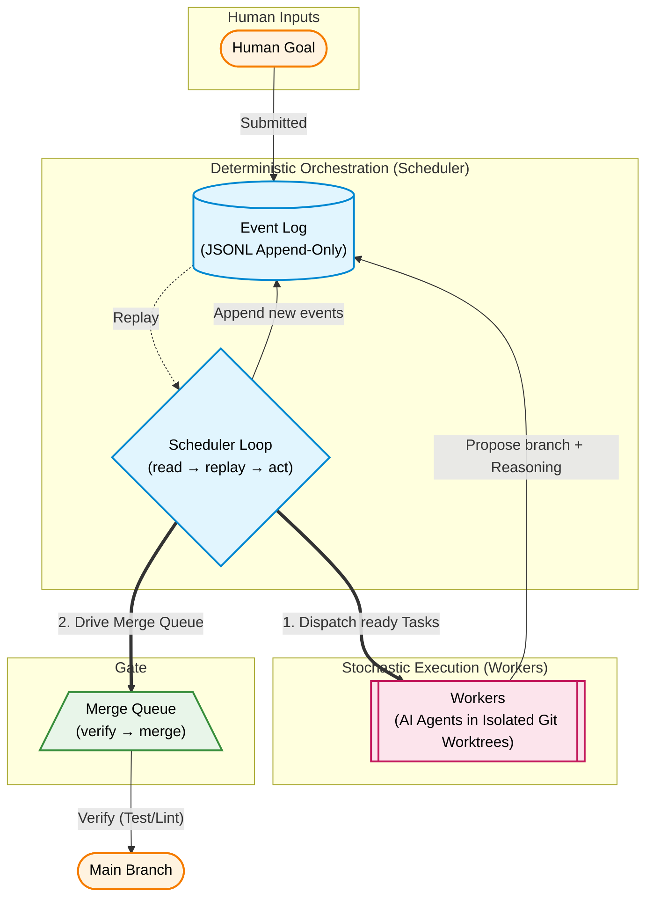

# Age of Agents — Architecture

A minimal, **Gate-verified** orchestrator for fleets of AI coding agents. It keeps the small set of
distributed-systems primitives that map to real, measured failure modes, and removes the
anthropomorphic and game-theoretic machinery that the research shows is the wrong tool for *aligned*
coding agents.

> **Design thesis.** The bottleneck in multi-agent coding is **verification + specification +
> idempotency**, not hierarchy, markets, or multi-agent debate. So we invest there and nowhere else.

## 1. Why this design

The design invests in verification, specification and idempotency, and refuses hierarchy, markets and
debate. That is not a taste preference — it follows from what the evidence says goes wrong in
multi-agent systems. Every figure below is quoted from the paper cited, and the
[reading list](reading-list.md) says which claim each source supports.

- **Most multi-agent failures are coordination, design and verification failures — not model
  failures.** The MAST taxonomy (Cemri et al., *Why Do Multi-Agent LLM Systems Fail?*,
  arXiv:2503.13657) analysed 1,642 traces across 7 frameworks and found a **41%–86.7% failure rate**.
  It splits failures into **System Design 41.8%**, **Inter-Agent Misalignment 36.9%** and **Task
  Verification 21.3%**. The single largest individual mode is **Step Repetition (FM-1.3), 15.7%** — a
  state-identity problem, which is why idempotency keys are load-bearing here ([ADR 010](adr/010-semantic-idempotency.md)).
- **Consensus voting has a "popularity trap."** Vallecillos-Ruiz, Hort & Moonen (arXiv:2510.21513)
  find that consensus selection "fall[s] into a 'popularity trap,' amplifying common but incorrect
  outputs", while a diversity-based selector reaches up to 95% of the ensemble's potential. Majority
  voting is the wrong selector for code — and a Gate is not a vote ([ADR 005](adr/005-no-markets-no-consensus.md)).
- **Self-correction without external feedback is unreliable.** Huang et al. (ICLR 2024,
  arXiv:2310.01798) find that LLMs "struggle to self-correct their responses without external feedback,
  and at times, their performance even degrades after self-correction." A second opinion from the same
  model is not an oracle; a compiler and a test suite are ([ADR 002](adr/002-verifier-gated-merge-queue.md),
  [ADR 011](adr/011-debate-markets-as-offline-tools.md)).
- **Multi-agent is weak for interdependent tasks, and costs far more tokens than a single agent**
  (Anthropic, *How we built our multi-agent research system*). Coding is highly interdependent, so
  parallelism has to be paired with hard gates and good decomposition rather than raw agent count.
- **Coordinate through shared state, not direct messaging.** Workers read and write a shared Event Log
  instead of messaging each other, which removes inter-agent misalignment — the second-largest MAST
  category — as a class ([ADR 006](adr/006-emergent-task-graph-blackboard.md)).

## 2. Design principles

1. **Event Log is truth.** An append-only log is the single source of truth; all state is derived by
   replaying events. Crash recovery, audit, and time-travel debugging come for free.
2. **The Gate verifies everything.** Nothing reaches `main` unless a real Gate (build / tests / lint)
   passes. Correctness is checkable for code — lean on that, not on agent opinions.
3. **Idempotency by construction.** Every unit of work carries an Idempotency Key; re-running a
   completed step is a no-op. Directly attacks the #1 failure mode.
4. **Deterministic coordination, stochastic execution.** The Scheduler is plain Go code,
   not an LLM. Only the *work* is done by stochastic agents.
5. **Coordinate through the Shared Log.** Workers never message each other; they read/write the Event Log.
6. **Keep the substrate boring and portable.** One static binary, plain JSONL, one config file, git
   only. No databases, no brokers, no required external services.

## 3. The model

**Domain objects**

- **Goal** — a human-submitted objective. Decomposed into Tasks (initially, and at runtime as Workers
  discover more work).
- **Task** — an atomic unit of work with an Idempotency Key and `depends_on` edges. Only
  dependency-ready Tasks are dispatchable. Workers may create new Tasks at runtime (emergent
  decomposition). In the Go code, Tasks are represented by the `Ticket` type.
- **Worker** — an agent session that executes one Task in an isolated git worktree and returns a
  **Proposal** (a branch/commit + a short reasoning trace).
- **Proposal** — a candidate change submitted to the Merge Queue.
- **Gate** — configured commands (e.g. `go build`, `go test`, `golangci-lint`) whose exit status
  controls whether a Proposal is merged.

**The Scheduler loop** (`internal/orchestrator`): `read(Event Log) → replay to state → diff desired vs
actual → act (top the worker pool up to the Concurrency Limit; run Stall Detector; drive Merge Queue)
→ append resulting events → repeat`. Dispatch is asynchronous across passes — a worker that finishes
early frees its slot immediately rather than waiting for its siblings ([ADR 013](adr/013-worker-pool-not-dispatch-wave.md)).
There is exactly one control loop.

## 4. Components (Go packages)

| Package | Responsibility |
|---------|----------------|
| `pkg/api` | Event envelope + the small event set (see §6). |
| `internal/ledger` | Append-only JSONL Event Log: `Append`, `Read`, `Replay`. |
| `internal/state` | Replays events into `State` (Tasks, dependencies, Workers, Merge Queue). |
| `internal/orchestrator` | The Scheduler: dispatch + Concurrency Limit + Stall Detector + Merge Queue driver. |
| `internal/agent` | `Backend` interface (AI-provider abstraction) + `mock`, the CLI harness presets in `cli.go`, and the native `openai`/`anthropic` Backends. |
| `internal/worktree` | Git worktree provisioning / cleanup for isolated Worker sandboxes. |
| `internal/verify` | Run configured Gate commands; capture pass/fail + output. |
| `internal/mergequeue` | Serialize Proposals → verify → merge to `main` or reject; emit events. Batches disjoint-file Proposals into one Gate run. |
| `internal/metrics`, `internal/diagnose` | Pure replay projections: run metrics + the MAST/deterministic failure-mode histogram. |
| `internal/otel` | Replay projection to OpenTelemetry (OTLP traces + metrics), post-hoc or live; off by default (ADR 012). |
| `internal/bench`, `internal/liveeval` | Hermetic coordination benchmark; backend-agnostic end-to-end eval harness (ADR 009). |
| `internal/config` | One TOML config: repo path, Gate commands, concurrency, Backend, governors, pricing, Conventions. |
| `cmd/aoa` | Tiny standard-library CLI, no framework. Full command and flag reference: [CLI reference](../cli.md). |

The **`agent.Backend`** interface is the only seam to the AI. Business logic never calls a provider SDK
directly. A deterministic **`mock`** Backend lets the entire loop run offline in `go test`; the CLI
harness Backends (**`claudecode`**, **`codex`**, **`cursor`**, **`gemini`**, **`grok`**) drive a real
agent as a subprocess in the Task's worktree, and **`openai`**/**`anthropic`** talk to an API directly.
A CLI harness is a row in a preset table rather than a file of its own, and the same table is reachable
from `aoa.toml` so an unlisted CLI needs no Go at all ([ADR 014](adr/014-cli-backends-as-data.md)).

**Observability is a projection, not instrumentation.** `metrics`, `diagnose`, and `otel` all derive
their output by replaying the Event Log — the same discipline as `state.Fold`. Nothing in the control
loop emits a metric or span; `internal/otel` turns a finished (or streaming) log into OTLP and is inert
unless an OTLP endpoint is configured, so the offline guarantee holds (ADR 012).

## 5. Why this does not bottleneck

1. **No central-planner bottleneck.** The Scheduler is deterministic code (sub-millisecond), so it is
   not a cognitive bottleneck the way a centralized planning LLM would be. We further avoid a rigid
   up-front plan: a Worker can emit `TicketCreated` to extend the shared Task Graph at runtime
   (emergent decomposition) — coordination via the Shared Log, no central coordinator.
2. **The Merge Queue is not a global barrier.** It serializes only *writes to `main`* (required for
   linearizability/correctness); it does **not** block Worker dispatch — Workers keep claiming ready
   Tasks while the queue drains. It also batches **disjoint-file** Proposals into a single Gate run (with
   a serial fallback when the sets overlap, or when an approval gate / shadow set is in play), cutting
   redundant verification without weakening linearizability.

## 6. Events

A single envelope `{seq, type, ts, actor, payload}` over an append-only JSONL log. The event set is
deliberately small:

`GoalSubmitted` · `TicketCreated` · `TicketDecomposed` · `TicketReady` · `TicketClaimed` · `WorkStarted` ·
`Heartbeat` · `ProposalSubmitted` · `VerificationPassed` · `VerificationFailed` · `Merged` · `TicketFailed` ·
`WorkerStalled` · `WorkerRestarted`. The optional human-in-the-loop approval gate (ADR 008) adds
`ApprovalRequested` · `ApprovalGranted` · `ApprovalDenied`. Cost/safety and steering add
`GoalBudgetExceeded` (spend governor), `RegressionEscaped` (the Gate's measured blind spot), and
`GoalAmended` (mid-run steering). Every metric, trace, and diagnosis is derived from this one stream.

State (Tasks, dependency readiness, Worker status, the Merge Queue) is derived by replaying this stream;
there is no separate mutable store to keep consistent.

## 7. What we deliberately do NOT build

| Rejected | Why (research) |
|----------|----------------|
| Markets + strategic bidding | Markets assume self-interested agents; aligned coding agents are a *pure coordination* problem. |
| Multi-agent consensus / voting | Consensus selection hits the popularity trap (arXiv:2510.21513), and self-correction without external feedback is unreliable (arXiv:2310.01798). An objective Gate instead. |
| Separate CQRS database | Extra moving parts; the JSONL Event Log already gives queryable, replayable truth. |
| Multi-tier escalation, federation, gossip, leader election | Single-node MVP; one Stall Detector + crash-only restart covers recovery. Defer until genuinely multi-node. |

These are revisitable, but each must earn its place against a measured failure mode. Note the scope: we
reject markets/voting/debate **as a live control plane or runtime selector** for aligned coding agents —
not as techniques with no use anywhere. Off the critical path (offline training-signal generation,
research evaluation) debate/ensembling can be useful; that would enter, if ever, as an offline tool
emitting ordinary `agent.Backend` work, never as a second coordinator (ADR 011).

## 8. How the four goals are met

- **Set up:** `go build` → one binary; `aoa init` scaffolds a repo + `aoa.toml`; zero required external
  services (git only).
- **Use:** `aoa goal "…"` then `aoa run` drives Goal → decompose → dispatch Workers → verify → merge,
  with a live view from `aoa status --watch`.
- **Validate:** the deterministic `mock` Backend runs the whole loop in `go test` with no network; the
  Gate is the correctness mechanism; the Event Log replays for debugging.
- **Port:** static Go binary, plain JSONL events, no DB, one config file.

## 9. Further reading

- [Metrics](metrics.md) — how we measure whether this design delivers.
- [Comparison](comparison.md) — how it differs from Gastown, Spec Kit + plan, and opencode ultraworker.
- [Reading list](reading-list.md) — every source the design rests on, and which claim each supports.
- [Decision records](adr/README.md) — the individual decisions and what was rejected.
