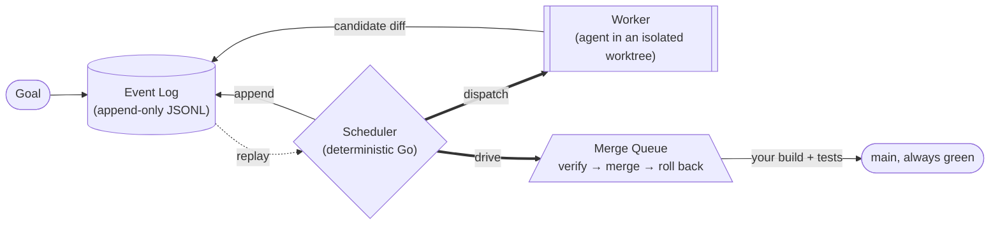

# Age of Agents

**Point an AI coding agent at your repo and it might write something broken. `aoa` runs the agent in a
throwaway git worktree, runs *your* build and tests on the result, and merges it only if they pass.**

It is a merge queue whose author happens to be a language model — Bors for AI agents. One static binary,
one config file, git only: no database, no broker, no service to run.

```
$ aoa goal "add table-driven tests for parseUsage"
$ aoa run

  [merged  ] g-45973ca0-impl  (attempts=2 tokens=606,669)
  total: tokens=606,669  wall=343.7s
  all work settled
```

<div class="grid cards" markdown>

- :material-rocket-launch: **[Get started](getting-started.md)** — from clone to a merged change, offline, in about ten seconds
- :material-download: **[Install](install.md)** — `go install`, a release binary, or from source
- :material-robot: **[Harnesses](harnesses/README.md)** — drive Claude Code, Codex, Cursor, Grok, Gemini, or any CLI you already have
- :material-tune: **[Configuration](config-reference.md)** — every `aoa.toml` field, with defaults
- :material-console: **[CLI reference](cli.md)** — every command and flag

</div>

## Why it exists

Most agent frameworks chase orchestration cleverness — role hierarchies, debate, consensus — which is
exactly the part that better models erode. `aoa` bets the other way: **verification, not intelligence,
is the scaling constraint.**

Scheduling, state, merge and done-ness are plain deterministic Go, gated on objective signals: your
build, your tests, your compiler. The LLM only ever emits a *candidate diff*; whether it lands is
decided by your Gate, not by the agent. Better models sharpen the worker; the control plane is unchanged.

## Three things a prompt can't do

**If you're supervising one agent on one change: just tell it to run the tests.** You don't need this.
`aoa` is for the other case — several agents at once, or none of them watched.

**1. The agent grades its own homework.** "Only commit if the tests pass" is a *request*. The agent
decides whether it ran them, which ones it ran, and what passing meant — and it's the same system that
was just confident about the code. `aoa` runs your Gate itself, in its own process, against the tree on
disk. What the agent claims isn't an input to the decision.

**2. Two agents that each pass alone can still break together.** A's change is green on A's branch, B's
is green on B's, and the merge of the two is red. Neither agent could see the other, so no prompt to
either one catches it. This is a *semantic merge conflict*, and it is the entire reason merge queues
exist. `aoa` merges first, runs the Gate on the **merged** state, and reverts if it's red.

**3. Nobody is watching.** State is a replay of an append-only log, so a run survives a crash — kill it,
re-run, it picks up. It stops before it burns a budget you set. It gives up on a task failing the same
way three times instead of retrying forever. A context window survives none of that.

## The shape of it



Everything is an event, and all state is a replay of the log — so crash recovery, audit trails and every
metric come for free rather than being built.

## What it does not do

No agent-to-agent messaging, no voting, no debate, no LLM coordinator, no role hierarchy. Those are
[deliberate refusals](design/adr/README.md), each with an ADR saying why.

## Where things stand

The loop closes end to end on real repositories, with real backends, on real money — with cost
accounting, spend governors and OpenTelemetry export. What is **not** yet established is whether the
Gate changes outcomes at scale: the SWE-bench numbers recorded so far were produced with the Gate
*disabled*, so those runs measure the backend agent rather than the merge queue. The numbers, and the
caveats that go with them, are in [live evaluation](design/live_eval.md) rather than compressed into a
headline solve-rate this project cannot stand behind.
